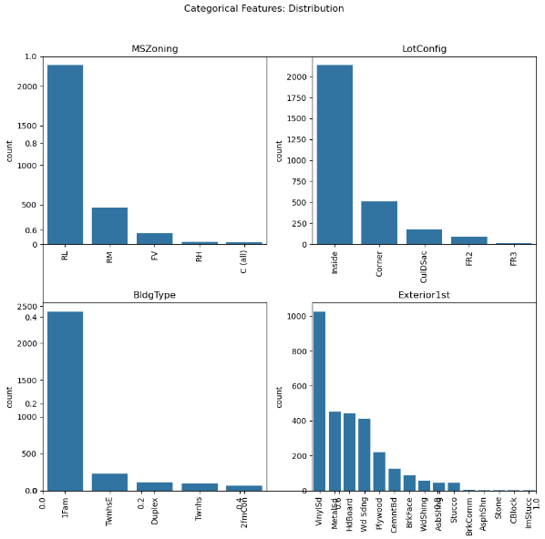
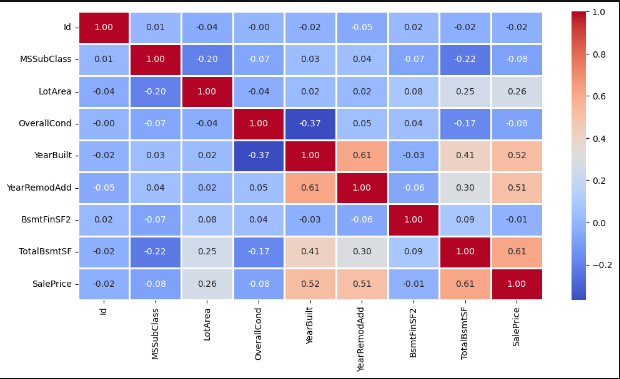

#  House Price Prediction using Machine Learning

This project focuses on **predicting house prices** based on various numerical and categorical property features using multiple machine learning regression models.  
The primary objective is to **analyze patterns in real estate data**, identify key factors influencing price, and determine the model that provides the most accurate price predictions.

---

##  Objective

The goal of this project is to:
- Analyze and preprocess housing data effectively  
- Understand correlations between property features and their influence on price  
- Develop and compare multiple machine learning models for regression tasks  
- Visualize data patterns and model performance through various plots  

---
##  Folder Structure

```bash
House-Price-Prediction/
│
├── House Price Prediction.ipynb                   # Main Jupyter Notebook with analysis, model building & evaluation
├── Graphical_results_House_pred/
│   ├── Categorical_features_Distribution.png      # Distribution of categorical variables
│   ├── Correlation_Matrix.png                     # Heatmap showing feature correlations
│   └── Model_comparision.png                      # Comparison of model performance metrics                 
├── HousePricePrediction.xlsx                      # Dataset used for model training and testing
└── README.md                                      # Project documentation file
```


##  Dataset Overview

The dataset (`HousePricePrediction.xlsx`) contains multiple features that influence the price of a house.  
Some of the major features include:

- **Lot Area** – Total area of the property  
- **Overall Quality** – Material and finish of the house  
- **Year Built** – Year when the house was constructed  
- **Total Basement Area** – Area of the basement (in sq ft)  
- **1st Floor Area** – Area of the first floor (in sq ft)  
- **GrLivArea** – Above ground living area (in sq ft)  
- **Garage Area** – Size of the garage (in sq ft)  
- **SalePrice** – Target variable representing the price of the house  

---

##  Models Implemented

The following regression models were implemented and compared:

1. **Linear Regression**  
2. **Decision Tree Regressor**  
3. **Random Forest Regressor**  

Each model was evaluated using key performance metrics like:
- **R² Score**
- **Mean Absolute Error (MAE)**
- **Mean Squared Error (MSE)**
- **Root Mean Squared Error (RMSE)**

> The **Random Forest Regressor** and **Linear Regression**  achieved the highest prediction accuracy, indicating its robustness in handling both categorical and continuous data.

---

##  Data Visualizations

The project includes visualizations to better understand feature relationships and model performance.

### 1. Categorical Features Distribution  


### 2. Correlation Matrix  


### 3. Model Comparison  


##  Key Insights

- Strong correlation observed between **Overall Quality**, **GrLivArea**, and **SalePrice**  
- **Categorical features**, such as neighborhood, also play a crucial role in determining price  
- Model ensembling and hyperparameter tuning significantly improved performance  

---

##  Tools & Technologies

- **Programming Language:** Python 3.10+  
- **Environment:** Jupyter Notebook  
- **Libraries Used:**
  - `pandas`
  - `numpy`
  - `matplotlib`
  - `seaborn`
  - `scikit-learn`

---

##  Conclusion

- The project successfully predicted house prices using multiple ML regression algorithms.  
- **Random Forest Regressor** demonstrated the best performance, balancing accuracy and generalization.  
- The workflow highlights the importance of **feature correlation analysis**, **data preprocessing**, and **model comparison** in achieving reliable real-estate predictions.

